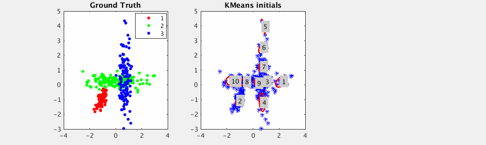
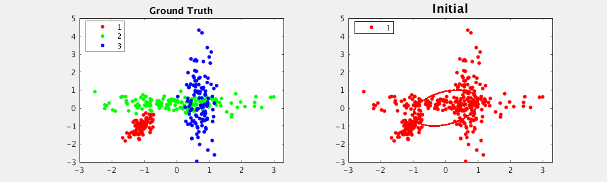

# UnsupervisedClustering

Unsupervised Clustering with Unknown Number of Clusters:

1. Maximum A Posterior Expectation-Maximization algorithm
  * K. P. Murphy, Machine Learning: A Probabilistic Perspective. the MIT Press, 2012.
  * C. M. Bishop, Pattern Recognition and Machine Learning. Springer, 2007.

2. Non-parameteric Method: Chinese Resturant Processing (CRP)
  * R.M. Neal, Markov chain sampling methods for Dirichlet process mixture models. Journal of Computational and Graphical Statistics, 9(2), pp. 249-265, 2000.

